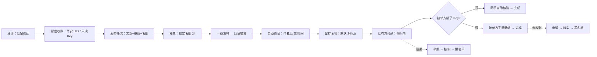
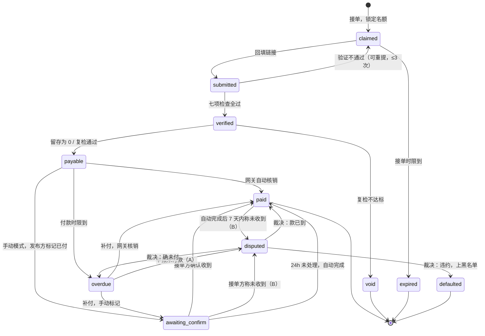
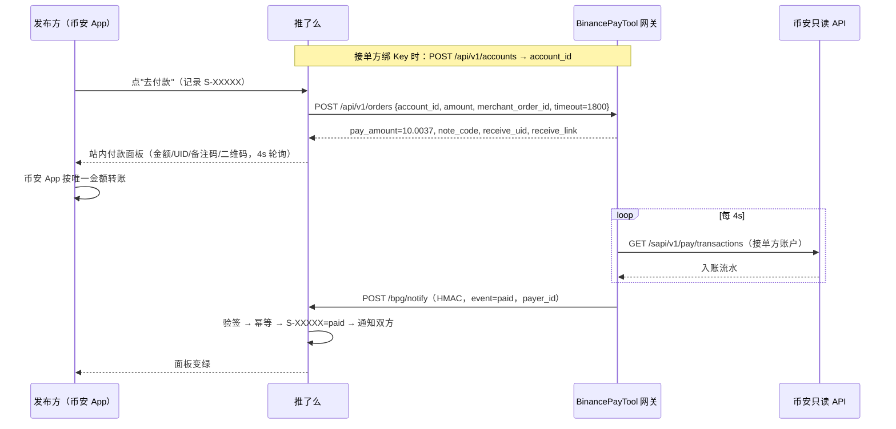

# 推了么 · 产品与技术设计 v0.2

> 项目代号 xjobclub · 设计版本 v0.2
>
> 一句话：**用 X 发帖证明"你是谁"，用币安支付证明"钱到了"，平台只做撮合、验证和记账，不碰一分钱。**

## 1. 定位与设计原则

推了么是一个只做"推特发帖任务"的撮合平台：发布方写好推文并出价（USDT），接单方用自己的 X 账号原样发出，平台自动核验推文，发布方直接把钱转给接单方。

平台**非托管**：资金从发布方的币安账户直接到接单方的币安账户，平台不收款、不代付、不做担保。这个前提决定了整套设计的重心——既然管不了钱，就必须管住**身份**和**信用**。

| 原则 | 含义 | 由此推出的设计 |
|---|---|---|
| 身份即 X 账号 | 用户名 = X 用户名，注册/找回全靠"发一条带验证码的推文" | 账号绑定 X 数字 ID（不是用户名，用户名会改），一个 X 只能注册一个账号 |
| 钱不过手 | 平台永远不持有资金 | 到账确认要么靠接单方绑定的只读 API Key 自动核销，要么靠人工确认 |
| 信用可见、违规必上榜 | 非托管模式下唯一的约束力是公开信誉 | 黑名单榜按 X 用户名公示；付款记录、逾期记录公开在个人主页 |
| 一次违规即出局 | 核实违规 1 次即黑名单 | 举报→宽限→核实→上榜 的流程要短，证据链要自动留存 |
| 先把闭环跑通 | v1 只做发帖任务、只做 USDT | 任务类型/币种/通知渠道都留扩展位但不实现 |

## 2. 角色、术语与编号

| 术语 | 说明 |
|---|---|
| 发布方（雇主） | 发布任务并付款的人 |
| 接单方（推手） | 领取任务、用自己 X 账号发帖、收款的人。同一个账号可以同时是发布方和接单方 |
| 管理员 | 处理申诉/举报、维护黑名单、下架违规任务 |
| 任务 Task | 一条推文文案 + 单价 + 名额 + 规则，编号 `T-XXXXX` |
| 接单记录 Submission | 一个接单方在一个任务上的一次履约，编号 `S-XXXXX`，是付款与纠纷的最小单位 |
| 付款单 Payment | 一条接单记录对应的一次支付尝试（网关订单或手动登记） |
| 申诉 Dispute | 任何一方对接单记录/处罚提出的异议，编号 `D-XXXXX` |
| 验证码 | 注册/找回时要求发在推文里的一次性码，形如 `TLM-7F3K9Q` |
| U | USDT，内部以 e8 整数存储，展示最多 4 位小数 |

编号统一用不含易混字符（0/O/1/I）的大写字母数字，5 位，对外可读、可口述、可写进转账备注。

## 3. 核心流程



### 3.1 注册（发帖验证）

1. 访客打开注册页，平台签发验证码 `TLM-XXXXXX`（24 小时有效，一次性，绑定当前浏览器）。
2. 页面给出一键发帖按钮：手机端先试 `twitter://post` / Android `intent://` 深链，2 秒未唤起 App 再退回网页版 `https://x.com/intent/post?text=...`；桌面直接开网页 intent。推文文案可换模板、可编辑，但必须含验证码；文案顺带带上平台链接，形成自传播。
3. 用户把发出的推文链接贴回来（支持 `x.com` / `twitter.com` / `mobile.twitter.com`，路径 `/{handle}/status/{id}` 或 `/i/web/status/{id}`）。
4. 服务端抓取推文（方案见 §6），校验：正文含本浏览器持有的有效验证码；推文发布时间晚于验证码签发时间；作者 X 数字 ID 未注册过。
5. 校验通过后**不需要用户输入用户名**：用户名锁定为推文作者的 X 用户名，同时记录 X 数字 ID、昵称、头像、注册推文 ID（作为证据快照）。用户只需设置密码（≥8 位，PBKDF2 存储）。
6. 提示用户：验证推文可以删除，不影响账号。

> 注意：X 内置浏览器（从推文点进来的 WebView）拿不到 App 深链也常丢 cookie。检测到内置浏览器 UA 时，注册/找回页提示"用系统浏览器打开"并提供复制链接按钮，其它页面不拦截以保传播。

### 3.2 登录与找回密码

- 登录：X 用户名（不区分大小写，可带 @）+ 密码。会话 cookie 为 HMAC 签名，载荷含密码指纹，改密码/重置后旧会话全部失效。
- 找回密码：与注册同一套发帖验证流程（`purpose=reset`），**只按 X 数字 ID 匹配账号，绝不按用户名回退**（用户改名后旧名会被别人注册，按用户名找回等于把账号送人）；每个账号每天最多 3 次。找回成功后顺便同步最新用户名/昵称/头像。
- 用户名漂移：用户在 X 改名后，登录仍可用注册时的用户名；下次做任何发帖验证时自动同步新名。若旧用户名被别人在 X 注册并来平台注册，因数字 ID 不同会建新账号，老账号的用户名字段标记为过期并允许用 X 数字 ID 登录，同时通知其重新验证同步。

### 3.3 绑定收款（所有用户）

任何用户都要在"收款设置"里绑定一个币安账户，这是接单的前提，也是发布的前提（理由见 §5.1）。

| 方式 | 需要填写 | 到账确认 | 适合谁 |
|---|---|---|---|
| 方式一：只填 UID | 币安 UID（App 头像页可见，数字），可选收款邮箱 | **手动**：发布方付完登记订单号 → 接单方在平台点"已收到" | 大多数普通用户 |
| 方式二：只读 API Key（进阶） | UID + 现货 API Key/Secret（只勾"允许读取"） | **自动**：网关轮询该账户 Pay 流水，按唯一金额/备注码/订单号三把钥匙自动核销 | 接单量大、不想天天点确认的人 |

- API Key 与 Secret **不落推了么的库**：提交后直接转交 BinancePayTool 网关 `POST /api/v1/accounts`（网关先试拉一条流水验证 Key 可用，失败即报错返回，例如 Key 无效 / IP 未白名单 / 地区限制），推了么只保存返回的 `account_id` 与 UID。
- 方式二的 Key 可以随时解绑（网关侧 disable），解绑后自动降级为方式一。
- 币安 Pay ID 已于 2025-01-01 停用，收款标识就是 UID / 邮箱 / 手机 / 二维码，这也是为什么只让用户填 UID。多数用户看不懂"收款链接"、币安 App 也复制不出来，所以不做收款链接与二维码解析。
- UID 由用户自填、平台无法核验归属，所以**不做唯一约束**、不当身份锚（否则可以抢注别人的 UID 把人锁在门外）；重复 UID 在后台可见，黑名单里记录 UID 仅供管理员参考。身份锚见 §5.1。

### 3.4 发布任务

发布表单字段：

| 字段 | 规则 | 默认 |
|---|---|---|
| 任务标题 | ≤40 字，仅用于列表展示 | 必填 |
| 推文文案 | 1–5 个变体，每个按 X 加权长度 ≤280（CJK 每字算 2、链接固定算 23、emoji 算 2），发布后一旦有人接单即锁定不可改 | 至少 1 个 |
| 匹配方式 | `exact` 全文一致 / `contains` 包含即可（允许接单方加自己的话） | exact |
| 单价 | 每个完成名额支付的 U，0.1 ≤ 单价 ≤ 500 | 必填 |
| 名额 | 1–100，受发布方信用额度限制（§5.2） | 必填 |
| 接单时限 | 接单后多久内必须回填链接，30 分钟–24 小时 | 2 小时 |
| 留存时长 | 推文必须保留多久才算完成，0 / 24 / 72 / 168 小时 | 24 小时 |
| 付款时限 | 进入待付款后发布方须在多久内付清，24 / 48 / 72 小时 | 48 小时 |
| 任务截止 | 截止后不再接受新接单，最长 30 天 | 7 天 |
| 接单要求 | 可选：X 账号注册满 N 天（按 X 数字 ID 估算，不调任何接口，§5.3） | 无 |

- 为什么要"文案变体"：X 对大量账号发同一段文字有重复内容降权与平台操纵判定（见 §11.3），多变体 + `contains` 模式是平台给用户的减害手段，发布表单要明确提示。
- 发布前校验：发布方已绑收款、无逾期未付、不在黑名单、名额×单价不超过信用额度。
- 任务发布后可以：暂停/恢复接单、取消剩余名额（只影响还没被领取的名额；已领取的照常走到过期或提交）、延长截止。不可以：改文案、改单价、缩短留存/付款时限。
- 任务详情页公开展示发布方信用：已付款单数、平均付款用时、逾期次数、注册日期，让接单方自己判断。

### 3.5 接单与发帖

1. 接单方在任务页点"接单"：校验自己已绑收款、不在黑名单、并发接单数未超上限、没有在这个任务上进行中的记录（过期/作废满 24 小时后可再接）。通过则锁定一个名额，生成接单记录 `S-XXXXX`，状态 `claimed`，倒计时开始。
2. 多变体任务在接单时按轮转分配一个变体，接单页只展示分配到的那一条，减少同文扎堆。验证时接受该任务的任一变体（优先比对分配到的那条）——变体是为了分散文案，不是给接单方设卡。
3. 接单页提供与注册页同款的一键发帖按钮，文案已预填，接单方只需点发送。
4. 发出后把推文链接贴回接单页提交。接单时限内允许最多 3 次提交（验证失败可改正重发）。
5. 时限内没有提交 → 记录 `expired`，名额释放回任务；同一人 24 小时内不得再接同一任务。

### 3.6 自动验证

提交链接后服务端立即抓取推文并逐项核对，全部通过才算 `verified`：

| 检查项 | 规则 | 不通过时给接单方的提示 |
|---|---|---|
| 链接可解析 | 域名白名单 + 能提取 19 位左右的数字 ID | 链接格式不对，请复制推文详情页地址 |
| 推文可读 | 接口返回正文与作者；受保护账号/已删除/不存在都读不到 | 推文读不到：请确认已公开发布、账号未设保护 |
| 作者是本人 | 推文作者 X 数字 ID == 账号绑定的 X ID（不比对用户名） | 这条推文不是你的账号发的 |
| 未被占用 | 推文 ID 全局唯一，一条推文只能核销一条接单记录 | 这条推文已经用过了 |
| 时间合理 | 推文发布时间 ≥ 任务发布时间 | 推文早于任务发布，不能用旧推文 |
| 是原创帖 | 不是回复（回复触达远低于原帖）；引用推文允许 | 请发原帖而不是回复 |
| 正文匹配 | 规范化后与任务任一变体一致（exact）或包含（contains） | 正文和任务文案不一致，差异处高亮显示 |

正文规范化：把 X 返回正文中的 `t.co` 短链按 `entities.urls` 还原为原链接；HTML 实体反转义；Unicode NFKC；连续空白折叠为一个空格；去首尾空白；比对时忽略大小写差异的仅限链接部分。发布任务时对文案做同样规范化并保存，验证时两边比对的是规范化结果。

抓取瞬时失败（超时/限流）不算失败：记录进入 `submitted` 并后台按 1、5、15、60 分钟重试，接单时限因此顺延，页面显示"验证中"。

任何一步不通过都把原因写进记录并展示给接单方；接单方认为误判可以申请人工复核（§3.9 类型 C）。

### 3.7 留存复检

- 任务留存时长 > 0 时，`verified` 后不立即进入待付款，而是在 `verified_at + 留存时长` 排一次复检。复检 = 重新跑一遍 §3.6 全部检查（推文还在、作者不变、正文仍匹配——防止发完验证后改文/删帖）。
- 复检通过 → `payable`（待付款），付款倒计时从此刻开始。
- 复检发现作者不符或正文被改（确定性结论）→ 记录 `void`（留存不达标），发布方不欠款，接单方页面显示原因。推文**读不到**（已删 / 受保护 / 被 X 临时锁号）不是确定性结论：间隔 ≥1 小时再确认，连续 3 次读不到才作废，避免临时锁号误伤。30 天内 3 次留存不达标 → 暂停接单 7 天（这是履约瑕疵，不是欺诈，不上黑名单）。
- 复检时接口持续不可用：按退避重试最多 12 小时，仍无结论则**判通过并打"复检未确认"标**，发布方在付款窗口内若发现推文已删可提交申诉（类型 D）。平台自己的抓取故障不应让做了事的接单方吃亏。
- 留存时长为 0 的任务：`verified` 即 `payable`。发布表单要提醒：0 留存意味着对方发完立刻可以删。

### 3.8 付款与到账确认

进入 `payable` 后，发布方在"待付款"列表看到这条记录，付款时限（默认 48 小时）倒计时开始。付款面板按接单方的收款方式分两种。

#### 3.8.1 接单方绑定了只读 Key（自动到账）

1. 发布方点"去付款"，平台向网关 `POST /api/v1/orders`：`account_id` = 接单方的网关账号，`currency` = USDT，`amount` = 单价，`merchant_order_id` = `TLM-<记录编号>-<序号>`，`timeout` = 30 分钟，`callback_url` = 平台回调。
2. 网关返回唯一金额（如 10 → 10.0037，尾数递进、按账号隔离、24 小时冷却）、6 位备注码、收款 UID、收款链接（有则生成二维码/手机唤起按钮）。付款面板不出站：大字金额一键复制、UID、备注码、倒计时、每 4 秒轮询状态、"我已付款但没变绿"回填入口。
3. 发布方在币安 App 转账。网关轮询接单方账户流水，命中即回调；平台验签（HMAC + 时间戳 + nonce）、按 `merchant_order_id` 幂等落库，记录 → `paid`，双方收到通知，发布方付款统计 +1，接单方收入 +1。
4. 30 分钟订单过期未付：发布方可再点一次生成新订单（新唯一金额），付款时限不变。
5. 网关回调 `underpaid`（备注/回填命中但实付少于单价）：记录进入 `awaiting_confirm` 并标"少付 X U"，接单方可选"接受实付、完成"或"要求补差"；要求补差时平台为差额再开一张网关订单，发布方补足后完成。
6. 网关回调里的 `payer_id` 留档，用于 §5.1 的付款方身份锚定。
7. 面板常驻「网关一直没确认？改为手动登记」入口：发布方填 18 位币安订单编号 → 记录转 `awaiting_confirm` 由接单方确认。地区限制导致流水接口恒为空、Key 中途失效或解绑，都不会让诚实付款的发布方逾期。
8. 记录到达终态（完成 / 作废 / 违约）时关闭它名下仍 `pending` 的网关订单，释放唯一金额；终态之后又收到 `paid`（重复付款）记为「多付」通知双方自行处理。

#### 3.8.2 接单方只填了 UID（手动确认）

1. 付款面板展示：接单方 UID、应付金额（原价，不加尾数）、建议备注（就写 `S-XXXXX`）、分步引导"币安 App → 支付 → 转账 → 输入 UID → 金额 → 备注"。
2. 发布方转完点"我已付款"，**必须**填写币安 App 转账详情里的 18 位订单编号（这是纠纷时唯一硬证据，也是防止随手乱点的门槛），记录 → `awaiting_confirm`。
3. 接单方收到通知，去币安 App 核对后点"已收到" → `paid`；点"没收到" → 进入申诉（类型 B）。
4. 每条接单记录单独转账，不合并付款：网关模式的唯一金额和手动模式的订单号都以单条记录为单位。
5. 发布方登记付款后，接单方须核对并确认；**超过 `AUTO_CONFIRM_H`（默认 24 小时）未处理视为已收到，自动完成**（类似电商自动收货，`confirm_method=auto`，不计入发布方信用）。自动完成后 `AUTO_DISPUTE_DAYS`（默认 7 天）内接单方仍可发起 B 类申诉，成立则撤销完成、记录转逾期、发布方上黑名单。等发布方补差中、以及已被举报过（A 类）的记录不自动完成（后者必须由接单方本人确认，防止"先赖账再假标记"靠对方沉默洗白）。原先的"接单方锁定"规则取消。
6. 标记已付本身不解除发布方的逾期冻结（见 §3.8.3），也不计入信用等级（见 §5.2）：一个零成本动作不能换来任何好处。

#### 3.8.3 逾期

- 付款时限到了记录仍未付/未标记 → 自动转 `overdue`，发布方立即被冻结：不能发布新任务，在线任务自动暂停接单，个人主页显示逾期中。冻结不需要人工。
- 冻结条件是派生的：名下存在 `overdue` 记录，或曾逾期（`overdue_at>0`）且尚未完成的记录（逾期后补标记进入 `awaiting_confirm`、被举报进入 `disputed` 都仍算），或有 B 类申诉在审。只有钱真正到位（接单方确认 / 网关核销 / 裁决已到账）才解冻——举报或标记都不能"洗掉"逾期。
- 接单方可在逾期后随时"举报未付款"（类型 A）。举报后发布方获得 24 小时宽限并收到强提醒；宽限期满仍未付，进入管理员核实队列。
- 逾期后补付走 §3.8.1/3.8.2 同样路径，完成后记录仍打"逾期付款"标，计入发布方公开统计。

### 3.9 举报与申诉

所有申诉/举报统一为 Dispute 对象，挂在接单记录上，双方在同一页面提交文字与截图（≤3 张、≤2MB、服务端去 EXIF），管理员在同一页面裁决。裁决结果与摘要对双方可见，处罚写入黑名单时附带申诉编号作为证据链。

| 类型 | 谁发起 | 场景 | 双方要交的证据 | 成立后的结果 |
|---|---|---|---|---|
| A 未付款 | 接单方 | 记录已 `overdue`，宽限期过 | 平台自动附：验证快照、复检结果、付款倒计时；发布方可补付或说明 | 发布方上黑名单；该发布方名下**所有**逾期未付记录一并转 `defaulted`，欠款金额挂在榜上 |
| B 标记已付但未收到 | 接单方 | 手动模式发布方点了"已付款"，接单方称没收到 | 发布方：18 位订单号 + 转账截图；接单方：Pay 流水截图 | 按"到账时间 vs 标记时间、实付 vs 应付、到账账户 vs 绑定 UID"分支：① 根本没付 → 发布方上黑名单，记录回 `overdue`；② 申诉后才到账 → 记录 `paid` 打"逾期+虚假标记"标，发布方记一次警告，再犯上榜；③ 到了但少付 → 按少付处理（接受或补差），不处罚；④ 接单方 UID 填错钱进了别人账户 → 记录 `paid`，损失自负，不处罚；⑤ 申诉前已全额到账仍否认 → 记录置 `paid`，接单方上黑名单 |
| C 验证误判 | 接单方 | 自动验证不通过但接单方认为已按要求发帖 | 推文链接；平台附规范化比对结果 | 管理员可强制 `verified`，并把案例记进验证规则的待改进列表 |
| D 推文不合格 | 发布方 | 仅限记录带"复检未确认"标的情况（复检已通过的记录，接单方按规则删帖不构成违约） | 发布方：截图；平台附复检时的抓取快照，不做当下重抓 | 成立 → 记录 `void`；不成立 → 维持待付款，付款倒计时按申诉占用时间顺延 |
| E 任务违规 | 任何人 | 任务内容涉诈骗、违法、侮辱等 | 举报理由 | 管理员下架任务：已验证/待付款的记录免留存直接进入待付款（活已经干了），未提交的记录作废并通知接单方删帖；情节严重封禁发布方 |
| F 黑名单申诉 | 被处罚人 | 认为处罚有误 | 补充证据 | 管理员可解除，榜上保留"已解除"记录；每次处罚只能申诉一次 |

证据窗口 72 小时：被申诉方 72 小时不回应，可依现有证据裁决。

裁决方：A、C、E、F 由管理员裁决；B、D 优先交小法庭（§3.11），不满足开庭条件时回到管理员。

申诉与记录状态的关系：只有 A、B 把记录置为 `disputed`（争的是钱）。C 发起时记录仍是 `claimed`，接单倒计时暂停（顺延 72 小时），成立则管理员直接置 `verified`；D 发起时记录仍是 `payable`，付款倒计时暂停，不成立则顺延。

### 3.10 黑名单与自动限制

黑名单是管理员核实后的处罚，自动限制是系统状态，两者要分开展示、分开解释。

| 状态 | 触发 | 效果 | 解除 |
|---|---|---|---|
| 黑名单（发布方） | 类型 A/B 成立 | 不能发布、不能接单；在线任务全部关闭；公示在黑名单榜（X 用户名、类型、金额、日期） | 仅管理员经类型 F 申诉解除。补付欠款不自动解除，但榜上会显示"已补付" |
| 黑名单（接单方） | 类型 B 中查实收到钱却称未收到 | 同上 | 同上 |
| 冻结（发布方） | 任一记录 `overdue`，或曾逾期且未完成，或有 B 类申诉在审 | 不能发布，在线任务暂停 | 逾期记录全部真正付清后自动解除 |
| 自动完成（接单方） | 任一记录 `awaiting_confirm` 超过 24 小时未处理 | 视为已收到，记录完成（不计信用） | 7 天内仍可发起 B 类申诉撤销 |
| 暂停接单 7 天 | 30 天内 3 次留存不达标 | 不能接单 | 到期自动解除 |

黑名单榜公开、可被搜索引擎索引，按时间倒序，每条含上榜时的 X 用户名与 X 数字 ID、身份、违规类型、涉及金额、申诉编号、当前状态。链接用 `https://x.com/i/user/{x_id}`（跟随改名），并注明"用户名可能已更改"——否则上榜者改个名就逃了，旧名还会落到无辜的新主人头上。公示是非托管平台唯一的威慑，但也意味着裁决必须有据可查——每条上榜记录都能点开看到脱敏后的证据摘要。

### 3.11 小法庭（用户陪审）

管理员一个人裁决"公说公有理"的争议既慢又容易被质疑偏袒。参考闲鱼小法庭：证据齐了以后，由随机抽选的用户投票裁决，管理员退到技术类、事实清楚类和上诉复核。

| 项 | 规则 |
|---|---|
| 适用类型 | B（标记已付但未收到）、D（推文不合格）默认走小法庭；A、C、E、F 走管理员。管理员可随时接管任一案件，也可把任一案件交给小法庭 |
| 开庭条件 | 证据期满（72h）；合格陪审员池 ≥ 50 人（冷启动前全部走管理员，规则页写明） |
| 陪审员资格 | 注册 ≥ 14 天；已完成 ≥ 3 条记录（任一角色）；不在黑名单、无冻结；与双方无关联（90 天内没有与任一方的接单或发布关系、不同 IP 段、不同 `payer_id`）；同时在审 ≤ 3 件；近 20 票与终裁一致率 ≥ 50%（前 10 票不计） |
| 抽选 | 从合格池随机抽 21 人发邀请（站内通知 + 待办），凑齐 7 票且非弃权票 ≥ 5、不平局即结案；24 小时未凑齐再抽 21 人；48 小时截止时同样条件，否则转管理员 |
| 投票 | 支持发起方 / 支持被诉方 / 证据不足弃权，附 ≤ 100 字理由。投票期间票数对所有人隐藏；结案后公开票型与理由，陪审员身份对双方匿名、对管理员可见 |
| 裁决效力 | 多数票即裁决，写回接单记录状态。涉及上黑名单的裁决先进入 24 小时上诉期，任一方可申请管理员复核（每案一次），逾期自动生效 |
| 激励与约束 | 与终裁一致 +1 陪审分（个人主页显示陪审等级），弃权与不一致 0 分；20 票内一致率 < 50% 取消资格 30 天；应邀不投票不扣分，但连续 3 次不响应 30 天内不再抽到。不给钱，杜绝买票 |
| 反串通 | 邀请名单不公开，双方看不到谁被抽中；同一陪审员对同一对当事人一年内最多审一次；在推文或私信里公开案件号拉票视为违规，查实取消资格并记入个人主页 |

- 案件页对所有登录用户可见（事实时间线、双方陈述、证据缩略图），只有被抽中的陪审员看到投票表单。归档案件公开，是新用户理解规则最好的教材。
- 数据：`jury_cases`（`dispute_id` 唯一、`status`：voting / closed / escalated、`round`、`deadline_at`、`verdict`、`votes_for` / `votes_against` / `abstain`）、`jury_invites`（`case_id`、`user_id`、`round`、`invited_at`、`voted_at`）、`jury_votes`（`case_id` + `juror_id` 唯一、`vote`、`reason`、`created_at`）、`users` 增 `jury_score`、`jury_total`、`jury_agree`、`jury_banned_until`。
- 页面：`/court` 小法庭大厅（我被邀请的案件、进行中案件、归档）、`/court/{code}` 案件页。
- 配置：`JURY_ENABLED`、`JURY_MIN_POOL=50`、`JURY_PANEL=7`、`JURY_INVITE=21`、`JURY_TYPES=B,D`、`JURY_WINDOW_H=48`、`JURY_APPEAL_H=24`。

## 4. 状态机与时间参数

### 4.1 接单记录状态机

接单记录是付款、锁定、纠纷、统计的唯一载体，所有业务规则最终都落在它的状态上。



| 状态 | 中文 | 谁在等 | 计时器 | 终态 |
|---|---|---|---|---|
| `claimed` | 已接单 | 接单方发帖 | 接单时限（默认 2h） | |
| `submitted` | 验证中 | 系统抓取 | 后台重试，顺延接单时限 | |
| `verified` | 已验证 | 留存复检 | 留存时长（默认 24h） | |
| `payable` | 待付款 | 发布方 | 付款时限（默认 48h） | |
| `awaiting_confirm` | 待确认到账 | 接单方 | 24h 未处理自动完成（12h 提醒）；等补差中、已举报过的除外 | |
| `overdue` | 逾期未付 | 发布方 | 举报后 24h 宽限；期间发布方被冻结 | |
| `disputed` | 申诉中（仅 A / B） | 管理员或小法庭 | 证据窗口 72h；C / D 不改变记录状态 | |
| `paid` | 已完成 | | | 是 |
| `void` | 作废（留存不达标 / 裁决不合格） | | | 是 |
| `expired` | 未按时提交 | | | 是 |
| `defaulted` | 违约（发布方已上榜） | | | 是；补付后标"已补付"但状态不变 |

### 4.2 任务状态

任务只有三个状态：`open`（接受接单）、`paused`（发布方暂停或因冻结自动暂停）、`closed`（到截止时间 / 发布方取消剩余名额 / 管理员下架）。名额满不触发关闭：满员后有人过期或作废，名额自动放回，截止前仍可被接。"已满"不是状态而是派生值：占用名额的记录 = 状态不是 `expired` 也不是 `void` 的记录（`defaulted` 也占：活干了，只是没给钱）；可接名额 = 总名额 − 占用数；接单过期释放名额后任务自动重新可接。关闭任务不影响任何进行中的接单记录，欠款照欠。

### 4.3 申诉状态

`open`（发起，通知对方）→ `evidence`（双方补证，72h 窗口）→ `review`（管理员处理中）或 `jury`（小法庭投票中，§3.11）→ `appeal`（涉黑名单裁决的 24h 上诉期，仅小法庭裁决有）→ `resolved`（结论：成立 / 不成立 / 部分成立）。结论写回接单记录状态，处罚写入黑名单表，全程记审计日志。

### 4.4 参数表

| 参数 | 默认 | 范围 | 谁定 |
|---|---|---|---|
| 验证码有效期 | 24h | 固定 | 系统 |
| 找回密码次数 | 3 次/账号/天 | 固定 | 系统 |
| 接单时限 | 2h | 30min–24h | 发布方按任务 |
| 提交重试次数 | 3 | 固定 | 系统 |
| 抓取重试 | 1/5/15/60 分钟 | 固定 | 系统 |
| 留存时长 | 24h | 0/24/72/168h | 发布方按任务 |
| 复检无结论上限 | 12h 后判通过并打标 | 固定 | 系统 |
| 付款时限 | 48h | 24/48/72h | 发布方按任务 |
| 举报后宽限 | 24h | 固定 | 系统 |
| 确认到账提醒 | 12h（自动完成前） | 配置 `CONFIRM_REMIND_H` | 系统 |
| 自动完成 | 标记后 24h | 配置 `AUTO_CONFIRM_H` | 系统 |
| 复检读不到确认 | 3 次，间隔 ≥1h | 固定 | 系统 |
| 待确认不计敞口 | 标记满 7 天 | 固定 | 系统 |
| 证据窗口 | 72h | 固定 | 系统 |
| 网关订单有效期 | 30min | 120s–24h（网关限制） | 系统 |
| 单价 | — | 0.1–500 U | 发布方 |
| 名额 | — | 1–100 且受额度 | 发布方 |
| 任务截止 | 7 天 | 1–30 天 | 发布方 |
| 并发接单上限 | 新手 2 / 常规 5 | 见 §5.2 | 系统按信用 |
| 留存不达标惩罚 | 30 天内 3 次 → 暂停接单 7 天 | 固定 | 系统 |

## 5. 信任与风控

非托管平台的两个根本问题：发布方拿了推文不给钱；被拉黑的人换个号回来。所有风控都围绕这两点。

### 5.1 三层身份锚

| 锚 | 来源 | 能防什么 | 局限 |
|---|---|---|---|
| X 数字 ID | 注册推文的作者 `user.id_str` | 改名逃避、用户名被抢注 | 新注册一个 X 号很容易 |
| 付款方账户 ID | 网关回调的 `payer_id` | 真正付过款的发布方身份被钉死，换 X 号也认得出 | 只有走网关的付款才能拿到；且网关当前 `payer_id` = 流水里 `payerInfo.binanceId`（缺失时退回 `counterpartyId`），两个命名空间混用，同一人可能得到两个 ID。**网关已改**（2026-09-09，待部署新版网关）：回调与查单新增 `payer_binance_id` 与 `counterparty_id` 两个字段，`payer_id` 保持原语义兼容；平台以 `counterparty_id` 为锚，缺失时退回 `payer_id`。锚定仍只做软匹配（打标、给管理员看），不做硬阻断 |

三层里只有第二层可被平台核实，也是最硬的一层，因为币安账户需要实名，注册成本远高于 X 账号。建议加一步**发布方认证付款**：首次发布前向平台的网关默认账号付 0.1 U（相当于发布准入费），平台从回调里拿到 `payer_id` 记为该账号的付款身份；此后每笔网关付款的 `payer_id` 与之不符时打"非本人账户付款"标，黑名单记录 X ID、`payer_id`、UID 三个键：X ID 与 `payer_id` 用于阻断再注册/再认证，UID 仅供参考。这一步给发布方增加了一次转账的摩擦，通过 `CERT_FEE_ENABLED` 开关控制，默认开启。

### 5.2 信用额度

额度限制的是"一个从未证明过自己的人最多能让别人白干多少"。**升级数"计信用的完成"**：`status=paid` 且 `confirm_method IN (gateway, manual, admin)`（网关核销、接单方主动确认、裁决完成）且 `self_deal=0`（非自导自演：同账号 / 同付款账户 / 同 IP 段，接单时和付款结算时各判一次）且任务不是点赞 / 转发。超时自动完成（`auto`）不算——沉默不是确认，也堵住"假标记 + 等 24 小时"刷信用。常规要求来自 ≥2 个不同对手方，资深要求更多不同对手方，发布方资深还要求 ≥3 笔网关核销（有 `payer_id` 锚点才配 2000 U 敞口）。接单方等级与陪审员资格里的"已完成"用同一口径。

| 发布方等级 | 条件 | 敞口上限（未付名额 × 单价之和） | 同时在线任务 |
|---|---|---|---|
| 新手 | 已付款 < 3 单 | 20 U | 1 |
| 常规 | 计信用付款 ≥ 3 单且来自 ≥ 2 个不同接单方、逾期 ≤ 1 | 200 U | 3 |
| 资深 | 计信用付款 ≥ 20 单、来自 ≥ 10 个不同接单方、其中网关核销 ≥ 3、逾期 ≤ 1、平均付款 < 24h（手动记录以标记时间计） | 2000 U | 10 |
| 管理员手动 | 线下认识的大客户 | 自定义 | 自定义 |

| 接单方等级 | 条件 | 并发接单 | 每日接单 |
|---|---|---|---|
| 新手 | 计信用完成 < 3 单 | 2 | 5 |
| 常规 | 计信用完成 ≥ 3 单且来自 ≥ 2 个不同发布方 | 5 | 20 |
| 资深 | 计信用完成 ≥ 30 单且来自 ≥ 5 个不同发布方、无留存不达标 | 10 | 50 |

数字全部放配置，上线后按数据调。

### 5.3 X 账号年龄估算（不调接口）

2016 年之后创建的 X 账号，数字 ID 是 snowflake：`创建毫秒 = (id >> 22) + 1288834974657`。ID 小于 10^12 的是 2016 年前的老号，直接视为满足任何年龄要求。这样"接单要求：注册满 90 天"不需要任何接口就能算，零成本挡掉刚注册的批量小号。

### 5.4 反作弊清单

| 风险 | 表现 | 对策 |
|---|---|---|
| 发完就删 | 验证通过后立刻删推 | 留存复检（§3.7）；0 留存任务发布时强提示 |
| 发后改文 | 把推广内容改掉 | 复检比对正文，不只看存在性 |
| 一推多用 | 同一条推文交给多个任务 | 推文 ID 全局唯一索引 |
| 旧推文充数 | 提交任务发布前的推文 | 发布时间 ≥ 任务发布时间 |
| 回复冒充原帖 | 在别人帖子下回复任务文案 | 拒绝回复类推文 |
| 发布方赖账 | 拿到推文不付 | 冻结 → 举报 → 黑名单 → 公示 + 欠款榜；新手敞口 20 U 封顶 |
| 假标记已付 | 手动模式乱点"已付款"，把接单方锁住 / 洗掉自己的逾期 | 标记不解除冻结、不计信用；24 小时后自动完成也不计信用，且 7 天内 B 类查实即撤销并上榜 |
| 收到装没收到 | 接单方讹钱 | 发布方有订单号 + 截图；查实即上榜 |
| 自导自演刷信用 | 自己发任务自己接、两个号互刷 | 同一账号不能接自己的任务；信用不数超时自动完成，且剔除自导自演（同账号 / 同付款账户 / 同 IP 段）（常规要 2 个不同对手方，资深要 10 个且发布方须有网关核销记录）；同 IP 段/同 `payer_id` 的发布-接单对打标不计入 |
| 幽灵接单方占额度 | 收了钱不点确认，永久占发布方敞口 | 待确认满 7 天不再计入敞口（记录仍待确认，B 申诉窗口保留） |
| 换号回归 | 被拉黑后新 X 号注册 | X ID 与 `payer_id` 阻断、账号年龄要求、新手额度；新号信用从零攒起，资深还要网关锚点 |
| 批量小号接单 | 一人控制多个 X 号刷任务 | 每 IP 每日接单上限、验证码签发限流、同设备指纹接单数上限、发布方可设账号年龄门槛 |
| 刷接口 | 脚本狂打验证/接单 | 全部写操作同源校验 + 每 IP 每账号限流 |

### 5.5 内容合规

- 任务文案禁止：诈骗与虚假收益承诺、违法信息、人身攻击、诱导点击的恶意链接。发布时做关键词与链接域名初筛，命中进人工审核而非直接拒绝。
- 发布表单提供"附加 #广告 / #推广 标签"开关（默认开），接单方在自己账号发商业内容加标签既符合多数地区广告法，也降低被 X 判为隐蔽营销的概率。
- 任何人可举报任务（类型 E）；管理员下架后已完成的接单记录付款义务不变——接单方按要求发了就该拿钱，内容责任在发布方。
- 平台条款写明：接单方对在自己账号发布的内容负责，接单前应阅读文案；被 X 限流或封号的风险由用户自担（与 BinancePayTool README 的风险声明同一口径）。

## 6. 推文抓取与验证实现

不接 X 官方 API。抓取使用 X 嵌入组件的公开接口 `https://cdn.syndication.twimg.com/tweet-result?id={id}&token={token}`，免 Key、免登录、秒级返回，`token` 由推文 ID 本地算出，算法与浏览器嵌入组件逐字一致。

用到的返回字段：

| 字段 | 用途 |
|---|---|
| `user.id_str` / `user.screen_name` / `user.name` / `user.profile_image_url_https` | 身份绑定、资料同步、头像 |
| `text` + `entities.urls[].url/expanded_url` | 正文规范化（t.co 还原） |
| `created_at` | 时间合理性检查 |
| `parent` / `in_reply_to_*` | 判定是否为回复 |
| `quoted_tweet` | 允许引用，仅记录 |
| `edit_control.edit_tweet_ids` / `isStaleEdit` | 推文被编辑时，复检按最新版本比对并记录版本变化 |
| 接口返回空 / 404 | 已删除、受保护、不存在——三者对平台的处理一致：读不到即不通过 |

工程约束：

- 服务端出口只允许访问 `cdn.syndication.twimg.com` 与头像域 `pbs.twimg.com`，不跟随跳转，响应体上限 512KB，解析前先 `DecodeConfig` 校验图片。
- 抓取结果写 `tweet_cache`（原始 JSON + 抓取时间 + 来源），验证与复检都基于快照，纠纷时可回看当时看到的内容。
- 并发抓取用信号量限制在 4 以内，单用户每分钟最多 10 次提交，避免把这个接口打出限流。
- 抓取层做成接口 `TweetSource`，只有一个实现。接口哪天失效再补第二实现，不预先接第二个源。

## 7. 支付集成（BinancePayTool）

### 7.1 部署形态

推了么**单独起一个网关实例**（同一二进制、独立 `config.env` / 数据库 / `API_AUTH_KEY`，监听 `127.0.0.1:8126`），不与其它站点共用：共用实例时一站解绑会停用另一站正在用的账号、一把 `API_AUTH_KEY` 泄露就能对两站伪造回调。用户在多个站点绑同一把只读 Key 互不影响（币安 Key 的 IP 白名单是同一台服务器）。网关的多账号模式（协议 §2.6）正好对应"每个接单方用自己的币安账户收款"。



回调地址填平台的内网地址（`http://127.0.0.1:8125/bpg/notify`），不绕公网；网关与平台同机，回调延迟毫秒级。

### 7.2 绑定 Key

1. 用户在收款设置填 UID、API Key、Secret（页面用 `autocomplete=off`，提交后表单即清空）。
2. 推了么直接转发 `POST /api/v1/accounts {api_key, api_secret, uid, label:"tlm:<user_id>"}`，网关先试拉流水，失败把币安原因原样带回（Key 无效 / IP 白名单 / 451 地区限制），成功返回 `account_id`。
3. 推了么只存 `bpg_account_id`、`uid`、`api_key_masked`，Key/Secret 从不落库、不进日志。`bpg_account_id` 唯一：同一个 Key 被第二个平台账号绑定时网关返回同一个账号 ID，第二个人绑定失败并提示。
4. 后台每小时 `GET /api/v1/accounts/{id}`：以 `status` 与 `last_ok` 时效为准，连续 3 次不健康才降级为手动模式；降级前先关闭该账号名下 `pending` 的网关订单并通知对应发布方改走手动登记，避免孤儿订单。一次瞬时 429 不降级。
5. 解绑 → `POST /api/v1/accounts/{id}/disable`。

同一把 Key 若在多个站点绑定，网关视为同一账号更新（`label` 会被后写的覆盖），不影响匹配；各站订单靠各自的 `merchant_order_id` 前缀区分（推了么用 `TLM-`）。

### 7.3 付款单生命周期

平台的付款时限（48h）远长于网关订单有效期上限（24h），所以两者分层：接单记录承载 48h 的付款义务；网关订单只是发布方点"去付款"后 30 分钟的一次结账会话。会话过期就再开一张，旧唯一金额进入 24h 冷却，网关保证不会错配。

| 网关事件 | 推了么处理 |
|---|---|
| `paid` | 记录 → `paid`，存 `binance_order_id`、`payer_id`、`actual_amount`、`matched_by` |
| `underpaid` | 记录 → `awaiting_confirm` 并标少付金额，走 §3.8.1 第 5 条 |
| `expired` | 付款单关闭，记录状态不变，发布方可重开 |
| 过期后宽限期内精确到账 | 网关仍回调 `paid`，正常处理 |
| 回调重复 / 乱序 | 同一订单状态只允许 pending→expired→paid 方向前进（`paid` 可覆盖 `expired`：宽限期内到账），其它重复直接 200 |

### 7.4 回调与对账兜底

- `/bpg/notify` 校验：时间戳偏差 ≤300s、HMAC 常数时间比较、nonce 5 分钟去重；不做同源校验（网关服务端调用）。
- 兜底：付款面板每 4s 轮询推了么自己的状态接口，推了么每 60s 对所有 `pending` 付款单主动 `GET /api/v1/orders/{id}` 对账一次，回调丢了也能在一分钟内补上；7 天内 `expired` 的订单每 10 分钟也查一次（网关回填窗口 7 天）。
- 回调原文整体存 `payments.raw_callback`，纠纷时可查。

### 7.5 手动模式

不经过网关，没有唯一金额。付款面板只展示 UID、原价、建议备注 `S-XXXXX`；发布方点"我已付款"必须填 18 位币安订单编号（正则 `^\d{18}$`，全局唯一，防一个订单号反复用）。接单方确认后完成。

### 7.6 边界情况

| 情况 | 处理 |
|---|---|
| 多付 | 网关 `overpaid=true` 仍 `paid`；多付部分平台不介入，双方自行处理，页面提示实付金额 |
| 少付 | 见 §3.8.1 第 5 条：接单方接受或要求补差 |
| 网关不可用 | 付款面板降级为手动模式提示，并显示"自动确认暂不可用"；付款义务与时限不变 |
| 接单方中途解绑 Key | 已开的网关订单照常匹配到过期；新付款走手动 |
| 接单方 UID 填错 | 钱到别人账上，平台无能为力，绑定页红字提醒并要求二次输入确认 |
| 唯一金额档位耗尽（`ERR_ALLOC`） | 同一接单方同价并发过多，几乎不会发生；发生则提示稍后重试 |

## 8. 数据模型

SQLite，金额 e8 整数，时间毫秒。主键均为自增整数，对外编号单独一列。

| 表 | 关键字段 | 说明 |
|---|---|---|
| `users` | `x_id` 唯一、`handle`、`handle_lower` 唯一、`display_name`、`avatar`、`pass_hash`、`pw_tag`、`role`、`status`（active/blacklisted/banned）、`reg_tweet_id`、`x_created_est`、`payer_id` 唯一可空 | 身份主表 |
| `xverify` | `code` 唯一、`purpose`（register/reset）、`secret_hash`、`user_id` 可空、`expires_at`、`used_at`、`tweet_id` | 验证码 |
| `pay_profiles` | `user_id` 主键、`binance_uid`（不唯一）、`receive_email`、`mode`（manual/gateway）、`bpg_account_id` 唯一可空、`api_key_masked`、`bpg_last_ok`、`bpg_last_err` | 收款设置 |
| `tasks` | `code` 唯一、`owner_id`、`title`、`contents` JSON、`contents_norm` JSON、`match_mode`、`reward_e8`、`slots_total`、`claim_ttl_min`、`retention_h`、`pay_window_h`、`deadline_at`、`min_account_days`、`ad_tag`、`status`、`published_at` | 任务 |
| `submissions` | `code` 唯一、`task_id`、`worker_id`、`variant_idx`、`status`、`claimed_at`、`claim_expires_at`、`tweet_id` 唯一可空、`tweet_url`、`tweet_snapshot_id`、`tweet_created_at`、`verify_attempts`、`last_verify_error`、`verified_at`、`recheck_due_at`、`recheck_flag`、`payable_at`、`pay_deadline_at`、`marked_paid_at`、`marked_order_id` 唯一可空、`confirmed_at`、`confirm_method`（gateway/manual/admin）、`paid_amount_e8`、`late` | 接单记录；编号 8 位（`S-XXXXXXXX`），防枚举 |
| `payments` | `submission_id`、`kind`（gateway/manual/topup）、`bpg_order_id`、`merchant_order_id` 唯一、`pay_amount_e8`、`note_code`、`status`、`binance_order_id`、`payer_id`、`paid_at`、`raw_callback` | 一条记录可有多张付款单 |
| `tweet_cache` | `tweet_id`、`fetched_at`、`ok`、`payload` JSON、`purpose`（verify/recheck/register） | 抓取快照；清理只删 180 天前且未被任何记录引用的行，证据链不断 |
| `disputes` | `code` 唯一、`type`（A–F）、`submission_id` 可空、`task_id` 可空、`opener_id`、`against_id`、`status`、`resolution`、`resolution_note`、`resolved_by`、`resolved_at` | 申诉 |
| `dispute_messages` | `dispute_id`、`author_id`（0=系统/管理员）、`text`、`images` JSON、`created_at` | 双方陈述与证据 |
| `blacklist` | `user_id`、`x_id`、`binance_uid`、`payer_id`、`reason`、`dispute_id`、`amount_owed_e8`、`repaid_at`、`lifted_at`、`lifted_by` | 处罚记录，榜单直接查此表 |
| `jury_cases` / `jury_invites` / `jury_votes` | 见 §3.11 | 小法庭 |
| `notifications` | `user_id`、`type`、`title`、`body`、`link`、`read_at` | 站内通知 |
| `audit_log` | `actor_id`、`action`、`target_type`、`target_id`、`meta` JSON、`ip` | 所有状态变更与管理员操作 |
| `meta` | | 会话密钥、定时任务水位等 |

派生而非存储：任务剩余名额、发布方是否冻结、信用等级、榜单统计。全部用索引查询实时算，避免状态不一致。

## 9. 页面、接口与后台任务

### 9.1 页面清单

| 路径 | 页面 | 要点 |
|---|---|---|
| `/` | 任务大厅 | 卡片：标题、单价、剩余名额、留存/付款时限、发布方信用摘要；筛选：单价、留存、账号年龄要求；登录后顶部是"我的待办" |
| `/t/{code}` | 任务详情 | 文案（多变体折叠）、规则、发布方主页链接与统计、接单按钮（不可接时写明原因） |
| `/new` | 发布任务 | 表单 + 实时 X 加权字数 + 额度提示 + 推文卡预览 |
| `/s/{code}` | 接单记录页（仅双方与管理员可见，含状态接口） | 双方共用一页按身份渲染：接单方看一键发帖 / 回填 / 时间线；发布方看付款面板 / 申诉入口；时间线列出每次状态变更与证据 |
| `/me` | 我的 | 待办（待付款、待确认、验证中）、我发布的、我接的、通知 |
| `/me/pay` | 收款设置 | 两种方式、当前状态、解绑 |
| `/u/{handle}` | 公开主页 | 头像、注册日、发布/接单统计、逾期与违约记录、信用等级 |
| `/blacklist` | 黑名单榜 | 公开、可索引、每条可展开证据摘要 |
| `/d/{code}` | 申诉页（仅双方、管理员、受邀陪审员可见；证据图经鉴权输出） | 双方陈述、证据、裁决结果 |
| `/court` `/court/{code}` | 小法庭 | 我被邀请的案件、进行中与归档案件；案件页含事实时间线与投票表单（仅受邀陪审员可见） |
| `/register` `/login` `/reset` `/logout` | 账号 | 发帖验证流程 |
| `/rules` | 规则页 | 把 §3–§5 用户可见的部分写成条款，含 X 政策风险提示 |
| `/admin` | 管理后台 | 申诉队列、举报队列、小法庭接管与上诉复核、黑名单管理、任务下架、用户搜索、参数配置 |

### 9.2 接口

- 账号：`POST /api/verify/issue` 签发验证码；`POST /api/verify/check` 提交推文链接（注册 / 找回共用，`purpose` 区分）。
- 任务与接单：`POST /t/{code}/claim` 接单；`POST /s/{code}/submit` 回填链接；`GET /s/{code}/status` 轮询验证与付款状态。
- 付款：`POST /s/{code}/pay/order` 开网关订单；`POST /s/{code}/pay/mark` 手动标记已付（带 18 位订单号）；`POST /s/{code}/confirm` 确认收到；`POST /s/{code}/dispute` 发起申诉。
- 回调：`POST /bpg/notify` 网关回调，验签，不做同源校验。
- 约定：页面以服务端渲染为主，JSON 只用于轮询与弹窗；所有写接口过同源校验、会话、限流、64KB 体积上限。

### 9.3 后台任务（进程内定时器）

| 任务 | 频率 | 做什么 |
|---|---|---|
| 接单过期 | 1 分钟 | `claimed` 超时 → `expired`，释放名额 |
| 验证重试 | 1 分钟 | `submitted` 中抓取失败的按退避重试 |
| 留存复检 | 1 分钟 | `recheck_due_at` 到期的重新跑七项检查 |
| 付款逾期 | 1 分钟 | `payable` 超时 → `overdue`，冻结发布方并通知 |
| 付款单对账 | 1 分钟 | `pending` 付款单主动查网关，补丢失回调 |
| Key 健康 | 1 小时 | 检查网关账号 `last_err`，失效降级并通知 |
| 提醒 | 1 小时 | 待确认 24h/72h、付款时限剩 12h、接单时限剩 30 分钟 |
| 清理与备份 | 每天 | 过期验证码、旧抓取快照、SQLite 在线备份保留 14 天 |

## 10. 技术选型与架构

**Go 单二进制 + SQLite（modernc，无 CGO）+ html/template + 原生 JS**，与 BinancePayTool 同一技术栈。

- 注册/找回、会话、限流、网关接入等基础模块与同栈的开源项目 [newbeggar](https://github.com/qianyubtc/newbeggar) 同源。
- 部署零新依赖：一台 VPS、一个网关实例、Caddy 反向代理，一个 systemd 单元。
- 交叉编译 linux/amd64 后上传服务器，服务器不需要安装 Go。

建议目录：

```
xjobclub/
  main.go config.go app.go store.go     启动、配置、路由、schema 与迁移
  auth.go xverify.go xapi.go            注册/登录/找回、验证码、推文抓取
  tasks.go submissions.go verify.go     任务、接单、七项检查与正文规范化
  recheck.go jobs.go                    留存复检与全部定时任务
  payment.go                            网关客户端、付款面板、回调、手动模式
  disputes.go blacklist.go admin.go     申诉、黑名单、后台
  notify.go ratelimit.go i18n.go util.go
  templates/  static/  deploy/  e2e/  DESIGN.md
```

配置（config.env）：`BASE_URL`、`LISTEN`、`DB_PATH`、`UPLOAD_DIR`、`BPG_URL`、`BPG_KEY`、`ADMIN_HANDLES`（管理员的 X 用户名列表，用自己的账号登录后获得后台权限）、`ADMIN_IP_ALLOW`（可选）、`TRUST_PROXY_HEADER`、`CERT_FEE_ENABLED`（认证付款开关）以及 §4.4 的全部默认参数。

部署：与网关同机，监听 `127.0.0.1:8125`，独立运行用户，systemd 单元 `xjobclub`，Caddy 反向代理。

测试：单元测试覆盖正文规范化、七项检查、状态转移、额度计算；端到端测试用 mock 的 X 抓取接口与 mock 网关跑通"注册 → 发布 → 接单 → 验证 → 付款 → 回调 → 完成"、"手动模式 → 确认"、"逾期 → 举报 → 裁决 → 上榜"等主线。

## 11. 安全、合规与风险边界

### 11.1 安全清单

- 会话：HMAC 签名 cookie，`SameSite=Lax` + `HttpOnly`，载荷含密码指纹；登录失败按 IP + 账号计数限流，不做按用户名的全局锁定（否则可以定向锁人制造违约），锁住了随时可用发帖验证重置。
- 写操作：同源校验（Origin / Sec-Fetch-Site）、64KB 体积上限、每 IP 与每账号限流。
- 出站请求：白名单只有 syndication 接口、`pbs.twimg.com` 头像、网关内网地址；不跟随跳转；超时 8 秒。
- 密钥：币安 Key 不落库、不进日志；`BPG_KEY` 只存在服务器 config.env；回调验签常数时间比较。
- 上传：证据图限 jpg/png、2MB、3 张；`DecodeConfig` 校验后重新编码去 EXIF；文件名用哈希；独立目录不可执行。
- 管理后台：管理员是配置里点名的 X 账号（`ADMIN_HANDLES`），走同一套登录；可选 IP 白名单；所有操作进 `audit_log`。
- 数据：每日 SQLite 在线备份保留 14 天；金额 e8 整数杜绝浮点。
- 响应头：CSP、`X-Frame-Options: DENY`（防止付款面板被嵌套诱导）、`Referrer-Policy`。

### 11.2 合规边界

- 非托管：平台不收、不付、不代管任务资金，不构成支付机构。若启用认证付款，它是固定小额服务费，收进平台自己的网关账户，与任务资金无关。
- 币安条款：个人账户跑收款属灰色地带，接单方绑 Key 的风险提示与 BinancePayTool README 同口径，只推荐只读 Key + IP 白名单。
- 黑名单公示：有据可查、可申诉、可解除；公示内容仅限 X 用户名、身份、类型、金额、日期，不公开截图与订单号原文。

### 11.3 最大外部风险：X 的平台操纵政策

> ⚠ X 的平台操纵与垃圾信息政策禁止"人为影响内容的发现与放大"，对重复文案有降权与处置，付费让多个账号发布同一段推广文案落在灰色地带；参与账号可能被限流、锁定甚至封禁，而 X 的处置通知通常不给具体原因。政策原文见 [X 平台操纵与垃圾信息政策](https://conductatlas.com/platform/x/x-rules-and-policies/platform-manipulation-and-spam-policy/) 与 [X 透明度报告](https://transparency.x.com/en/reports/platform-manipulation/2021-jul-dec/jcr:content/root)。

减害手段已内置：多变体文案、`contains` 模式鼓励加自己的话、#广告 标签默认开、每人每日接单上限、发布方可设账号年龄门槛。但风险消不掉：条款要写清楚，首页要有一句人话提示，接单页在发帖按钮旁再提示一次。

## 12. 里程碑

| 阶段 | 内容 | 验收 |
|---|---|---|
| M1 骨架 | 初始化、schema、注册/登录/找回/收款设置，任务发布与大厅 | 能注册、能发任务、能看到列表 |
| M2 闭环 | 接单、一键发帖、七项验证、留存复检、待付款、网关付款与回调（含手动登记兜底）、手动模式与确认、锁定/冻结 | e2e 两条主线全绿 |
| M3 信用 | 六类申诉、小法庭、管理后台、黑名单榜、个人主页与统计、信用额度、通知中心、规则页 | 一次完整的 A 类举报走到上榜；一件 B 类案件走完小法庭投票 |
| M4 上线 | 部署、Caddy、备份、冒烟、种子任务、首页与条款文案 | 真实小额跑通一单 |
| v1.x 备选 | Telegram 通知、多语言、付费置顶、带图任务、引用/转发任务类型 | 看上线数据定顺序 |

## 附录 · v0.3 增补（2026-09-10）

### A. 任务类型
- **发帖**：接单方用自己的账号发一条发布方写好的推文，自动验证（原有流程）。
- **评论**：接单方在目标推文下方直接回复，回填自己的评论链接；验证要求 `in_reply_to` 等于目标推文，文案可指定（全文 / 包含）或自由发挥（最少字数）。留存复检同发帖。
- **点赞**：公开接口读不到点赞名单，改为**发布方核对**：接单方提交核对 → 发布方在自己推文的点赞列表确认 / 退回；48 小时不处理视为通过；两次退回作废并释放名额，接单方 24 小时内可发起 G 类「核对争议」由管理员裁决。点赞任务的目标必须是发布方自己的推文。
- **转发**：先从接单方公开时间线自动检测转发，检测到直接待付款；检测不到走点赞同样的核对流程。
- 点赞 / 转发无留存复检、以核对当下为准、不计入双方信用等级；发布方对已进入待付款的点赞 / 转发记录可发起 D 类申诉。

### B. 发布审核（社区投票）
- 新任务先进入「审核中」：不进大厅、不能接单，只有发布方、管理员和有资格的审核人可见。
- 审核资格：注册满 24 小时、X 账号满 30 天、不在黑名单，不能审自己的任务，每天有次数上限。投「有问题」可附原因，理由匿名展示给发布方。
- 判定：满 N 票且通过率达标即上线（管理员收到抽查通知）；反对率达标转管理员裁定（不直接驳回，防小号联手封杀）；到期无像样反对自动上线，有反对转管理员。管理员可随时通过 / 驳回。
- 免审：默认没有（所有新任务都走审核，管理员也一样）；配置 `REVIEW_TRUSTED_PAID>0` 时，网关核销付款达到阈值且无逾期、无违约的发布方免审。
- 任务上线后若修改内容（仅限无人接单时），重新进入审核。未通过的任务改后重提，旧票清空。

### C. 按浏览量计价（CPM）
- 发帖 / 评论任务可选：每千次浏览单价、保底（≥ 0.01 U）、封顶（必填，作为敞口与等级口径）。留存至少 1 天。
- 留存期结束复检通过时读一次推文浏览量（公开接口），报酬 = 浏览量 ÷ 1000 × 单价，夹在保底与封顶之间，一次算清写入记录；付款、补差、申诉、欠款与公开记录都以该金额为准。
- 读不到浏览量：以原始留存到期时间起算，24 小时内每小时重试，之后按此前记录到的最大值结算（最低保底）。
- 刷量：不自动判罚；浏览量远超接单方粉丝数时提示发布方，付款期内可发起申诉，封顶兜底。

### D. 申诉类型补充
- **G 核对争议**：点赞 / 转发记录被发布方两次退回作废后，接单方 24 小时内发起，管理员裁决；成立则记录恢复为待付款（名额可能已被他人接走，按额外一单付款）。

### 提前付款（发布方放弃留存保护）

- 留存期内（记录为「已验证」）发布方可在记录页点「现在就付」：系统立刻复检一次（推文还在、内容一致；按浏览量计价的任务以此刻读到的浏览量结算），通过即进入待付款并通知接单方，付款时限从此刻起算；不达标则作废、无需付款。
- 读不到推文或 X 接口不可用时不做任何改动，只提示稍后再试，正常的留存复检计划不受影响。
- 提前付款是发布方自己的选择：付款后对方删帖，平台不再追责（记录上标「发布方提前付款」）。
