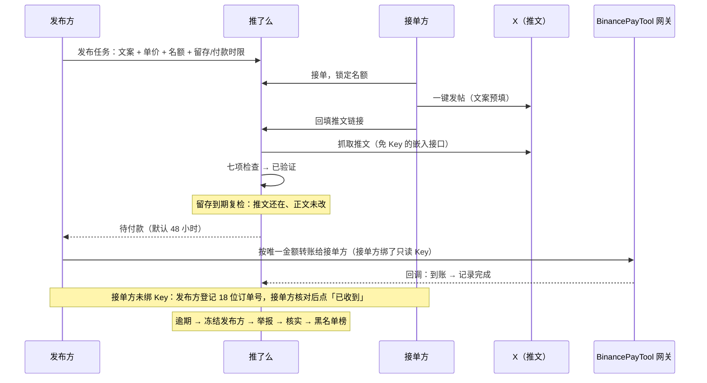

# 推了么 · xjobclub

> 基于 X（Twitter）的发帖任务撮合平台。
> 用 X 发帖证明"你是谁"，用币安支付证明"钱到了"，平台只做撮合、验证与记账，**不碰一分钱**。

[](LICENSE)

**本项目为社区项目，与 X / Binance 无任何关联。** 名称中的 X、币安仅用于描述所对接的平台，不代表官方授权或合作。

---

## 它解决什么问题

想让一批真人账号帮你发一条推广推文，传统做法是拉群、私聊、发红包、人工截图对账——发布方怕对方发完就删，接单方怕干完活收不到钱，中间人则要把钱先收上来再分。

推了么把这件事做成一个闭环：

| 环节 | 传统做法 | 推了么 |
|---|---|---|
| 身份 | 微信号 / 群昵称 | X 账号本身（发帖验证，一个 X 一个账号） |
| 派单 | 群里喊 | 任务大厅，明码标价，按名额锁定 |
| 验收 | 人工看截图 | 回填链接自动验证：作者、正文、时间、原帖，七项检查 |
| 防删帖 | 靠信任 | 留存复检：到期重新核对，删帖改文即作废 |
| 付款 | 中间人代收代付 | 发布方**直接**转给接单方；绑定只读 Key 可自动确认到账 |
| 赖账 | 拉黑踢群 | 逾期自动冻结 → 举报 → 核实 → 黑名单榜公示 |
| 争议 | 群主拍板 | 小法庭：随机抽选用户投票裁决，管理员复核 |

## 设计原则

- **非托管**。资金从发布方的币安账户直接到接单方的币安账户，平台不收、不付、不代管、不担保。这决定了整套系统的重心：管不了钱，就必须管住**身份**与**信用**。
- **身份即 X 账号**。注册、找回密码全靠"发一条带验证码的推文"，账号绑定 X 数字 ID（用户名会改，ID 不会）。
- **信用只认真金白银**。发布方的信用等级与敞口上限只数经网关自动核销的付款；手动确认只展示、不提额，两个小号点两下按钮刷不出信用。
- **违规必上榜**。经核实的赖账者按 X 数字 ID 公示在黑名单榜，换用户名逃不掉；每条处罚可申诉一次。
- **先把闭环跑通**。v1 只做发帖任务、只做 USDT。

完整的产品与技术设计（状态机、参数表、风控、数据模型）见 [DESIGN.md](DESIGN.md)。

## 运作流程



## 功能一览

- **账号**：X 发帖注册 / 找回密码；密码登录；在 X 改名后自动同步；X 内置浏览器检测与提示。
- **收款绑定**：只填币安 UID（手动确认），或再绑一把只读 API Key 走网关自动到账；Key 不落本站数据库。
- **发布方认证付款**：首次发布前向平台付 0.1 U，用网关回调里的付款方账户 ID 锚定身份（可配置关闭）。
- **任务**：1–5 条文案变体轮流分配（防重复内容降权）、全文一致 / 包含匹配、按 X 加权长度校验 280、#广告 标签、接单时限、留存时长、付款时限、截止、X 账号年龄门槛（按数字 ID 估算，零接口）。
- **接单与验证**：名额锁定、一键发帖深链（iOS / Android / 桌面）、三次提交机会、验证失败给出差异位置、抓取快照留证。
- **留存复检**：到期重跑全部检查；读不到时间隔 1 小时连续 3 次确认才作废，避免临时锁号误伤。
- **付款**：网关唯一金额 + 备注码 + 订单号回填三把钥匙自动核销；网关看不见时常驻"手动登记订单号"兜底；少付可接受或要求补差；终态自动关闭在途订单。
- **约束**：逾期自动冻结发布方（标记已付不能洗掉）；接单方待确认到账超 24 小时未处理则不能接单/发布；留存不达标累计暂停接单。
- **申诉**：六类申诉（未付款 / 标记已付未收到 / 验证误判 / 推文不合格 / 任务违规 / 黑名单申诉），举证、截图上传（去 EXIF）、当事方与管理员可见。
- **小法庭**：随机抽 21 名合格用户，前 7 票结案，涉黑名单的裁决有 24 小时上诉期；陪审员池不足时由管理员裁决。
- **黑名单榜**：公开可索引，记录上榜时的用户名与 X 数字 ID、原因、欠款、申诉编号、补付情况。
- **后台**：申诉队列、小法庭接管、用户搜索与处置、任务下架、黑名单解除，全部操作进审计日志。
- **信用**：发布方三档敞口（新手 20 U / 常规 200 U / 资深 2000 U）、接单方并发与每日上限，全部可配置。

## 快速开始

```bash
git clone https://github.com/qianyubtc/xjobclub && cd xjobclub
cp config.example.env config.env      # 至少填 ADMIN_HANDLES；有网关再填 BPG_URL / BPG_KEY
go build -o xjobclub . && ./xjobclub -config config.env
```

打开 http://127.0.0.1:8125 。没有配置网关时也能跑：所有付款走"发布方登记订单号 + 接单方手动确认"，认证付款自动关闭。

## 配置

所有配置项都在 [config.example.env](config.example.env) 里，每项有注释；同名环境变量优先。最常调的：

| 配置 | 默认 | 说明 |
|---|---|---|
| `BASE_URL` / `LISTEN` | `http://127.0.0.1:8125` | 对外地址（发推文案里会带上）与监听地址 |
| `ADMIN_HANDLES` | 空 | 管理员的 X 用户名列表，用自己的账号登录即有后台权限；`ADMIN_IP_ALLOW` 可选限制来源 IP |
| `BPG_URL` / `BPG_KEY` | 空 | BinancePayTool 网关地址与 `API_AUTH_KEY`；不填则没有自动到账与认证付款 |
| `CERT_FEE_ENABLED` / `CERT_FEE_AMOUNT` | `true` / `0.1` | 发布方认证付款 |
| `MIN_REWARD` / `MAX_REWARD` | `0.1` / `500` | 单价范围（U） |
| `RETENTION_OPTIONS` / `RETENTION_DEFAULT_H` | `0,24,72,168` / `24` | 留存时长可选项与默认 |
| `PAY_WINDOW_OPTIONS` / `PAY_WINDOW_DEFAULT_H` | `24,48,72` / `48` | 付款时限 |
| `CLAIM_TTL_MIN` | `120` | 接单后多少分钟内必须回填 |
| `EXPOSURE_NEWBIE/REGULAR/SENIOR` | `20/200/2000` | 三档敞口（未付名额 × 单价之和上限，U） |
| `JURY_*` | 见示例 | 小法庭：成庭 7 人、邀 21 人、48 小时、只审 B/D、上诉期 24 小时、陪审员池满 50 人才开庭 |
| `TRUST_PROXY` / `TRUST_PROXY_HEADER` | `false` | 反向代理后开启，限流按真实访客 IP |
| `X_TWEET_API` | `https://cdn.syndication.twimg.com` | 推文抓取接口基址，测试时指向 mock |

## 支付网关：BinancePayTool 独立实例

到账确认由 [BinancePayTool](https://github.com/qianyubtc/BinancePayTool) 完成：接单方在推了么绑定只读 Key 时，推了么把 Key 转交网关（`POST /api/v1/accounts`），只保存返回的账号 ID；发布方付款时推了么在该账号下开一张 30 分钟的结账订单，网关轮询接单方账户的 Pay 流水，命中后 HMAC 回调。

**建议给推了么单独起一个网关实例**（同一二进制、独立 `config.env` / 数据库 / `API_AUTH_KEY`，例如监听 `127.0.0.1:8126`），不要与其它站点共用：共用时一站解绑会停用另一站正在用的账号，一把密钥泄露就能对两站伪造回调。

网关实例的默认账号（`BINANCE_API_KEY` 等）是平台自己的收款账户，用于收认证付款。各账户的 Key 只需「允许读取」权限，IP 白名单填网关服务器出口 IP。

## 规则速查

| 规则 | 默认 |
|---|---|
| 验证码有效期 | 24 小时，一次性，绑定签发时的浏览器 |
| 接单时限 / 提交次数 | 2 小时 / 3 次 |
| 留存复检 | 默认 24 小时后；读不到需间隔 ≥1 小时连续 3 次 |
| 付款时限 | 48 小时；逾期即冻结发布方 |
| 待确认到账锁定 | 标记后 24 小时未处理即锁定接单方；确认或申诉解锁；不自动确认 |
| 举报宽限 / 举证期 | 24 小时 / 72 小时 |
| 留存不达标惩罚 | 30 天内 3 次 → 暂停接单 7 天 |
| 黑名单 | 核实一次即上榜；名下逾期记录全部转违约并公示欠款；每条处罚可申诉一次 |

规则页 `/rules` 会按当前配置自动渲染这些数值。

## 目录结构

```
main.go config.go app.go          启动、配置、路由/中间件/会话/模板函数
store*.go models.go               SQLite 数据层（schema 在 store.go）与领域类型
auth.go xapi.go                   发帖注册/找回/登录；推文抓取（X 嵌入接口）
tasks.go verify.go                等级/额度、发布、接单；七项检查与留存复检
submissions.go payment.go         记录页、提交、标记、确认；网关订单/回调/认证付款/收款设置
disputes.go jury.go admin.go      六类申诉与裁决执行、黑名单、下架；小法庭；后台
site.go jobs.go                   我的/主页/榜单/规则；定时任务（每分钟一轮）
templates/ static/                html/template 页面与样式（无前端框架，移动端优先）
deploy/                           systemd 单元与 Caddy 片段
DESIGN.md                         产品与技术设计
```

## 测试

```bash
go vet ./... && go test ./... -count=1
```

- `util_test.go`：正文规范化、X 加权长度、变体匹配、snowflake 年龄估算、金额换算、会话签名。
- `app_test.go`：用 mock 的 X 抓取接口与 mock 网关（含 HMAC 回调）跑通四条主线——网关自动到账、手动确认 → 逾期 → 举报 → 上榜、留存复检（通过 / 改文作废 / 删帖三次确认）、少付补差。
- `tok_test.go`：推文抓取 token 与浏览器 JS 输出逐字比对（需要 node 生成参考文件，没有则跳过）。

## 部署

1. 交叉编译（无需在服务器装 Go）：
   ```bash
   GOOS=linux GOARCH=amd64 CGO_ENABLED=0 go build -trimpath -buildvcs=false -ldflags="-s -w" -o xjobclub-linux-amd64 .
   ```
2. 服务器：`/opt/xjobclub/{xjobclub,config.env,uploads/}`，独立运行用户，`deploy/xjobclub.service` 装入 systemd。
3. 反向代理：`deploy/Caddyfile.snippet` 追加到 Caddyfile；开启 `TRUST_PROXY=true` 并把 `TRUST_PROXY_HEADER` 设为代理传真实 IP 的头（Cloudflare 为 `CF-Connecting-IP`）。
4. 网关：另起一个 BinancePayTool 实例（见上文），推了么的 `BPG_URL` 指向它的内网地址。
5. 数据：SQLite 单文件，程序每天 `VACUUM INTO` 到 `backups/` 保留 14 天；升级只需替换二进制并重启，schema 自动迁移。

## 安全设计要点

- 会话为 HMAC 签名 cookie（`HttpOnly` + `SameSite=Lax`），载荷含密码指纹，改密码即全端下线；登录失败按 IP + 账号限流，不做按用户名的全局锁定。
- 所有 POST 做同源校验（Origin / Sec-Fetch-Site），请求体 64 KB 上限（证据上传单独放宽）；CSP、`X-Frame-Options: DENY`。
- 出站请求只有 X 嵌入接口、X 头像域与网关内网地址；推文链接只认 X / Twitter 域名并只提取数字 ID，不跟随跳转。
- 币安 Key 与 Secret 不落库不进日志；网关回调常数时间验签 + 时间戳 + nonce；付款单状态只能单向推进，重复回调幂等。
- 记录页、申诉页、状态接口、证据图只对当事方、管理员、受邀陪审员开放；对外编号使用 8 位无歧义字符，防枚举。
- 所有状态变更与管理员操作写入审计日志，纠纷时可回放。

## 风险与边界（必读）

- **X 平台规则**：X 禁止人为影响内容的发现与放大，对重复文案有降权与处置。付费让多个账号发布相同推广内容处于灰色地带，参与账号可能被限流、锁定甚至封禁。平台内置多文案变体、包含匹配、#广告 标签、每日接单上限等减害手段，但风险由用户自担。
- **非托管**：平台不对交易结果提供担保。约束力来自冻结、黑名单公示与信用体系，而非资金托管。
- **币安条款**：个人账户绑定只读 Key 跑收款属币安条款灰色地带，与 BinancePayTool 的风险声明同一口径。
- **内容责任**：接单方对发布在自己账号上的内容负责；禁止诈骗、虚假收益承诺、违法与侮辱内容。

## 路线图

- [ ] Telegram 通知（目前仅站内通知）
- [ ] 多语言（复用同栈项目的 12 语骨架）
- [ ] 带图任务、引用 / 转发任务类型
- [ ] 付费置顶等增值功能
- [ ] 网关侧链上多币种收款（随 BinancePayTool 演进）

## 相关项目

- [BinancePayTool](https://github.com/qianyubtc/BinancePayTool)：币安支付个人收款网关，本项目的到账确认引擎。
- [newbeggar](https://github.com/qianyubtc/newbeggar)：同栈项目，X 发帖验证与网关接入的最初实现。

## License

[MIT](LICENSE)
